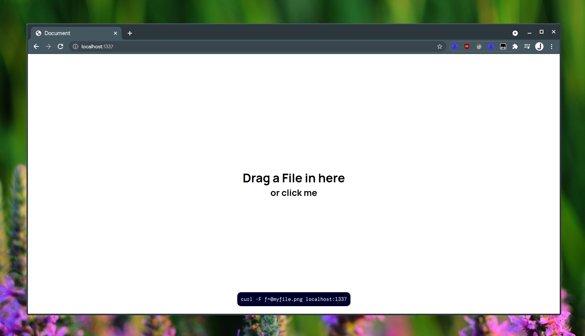
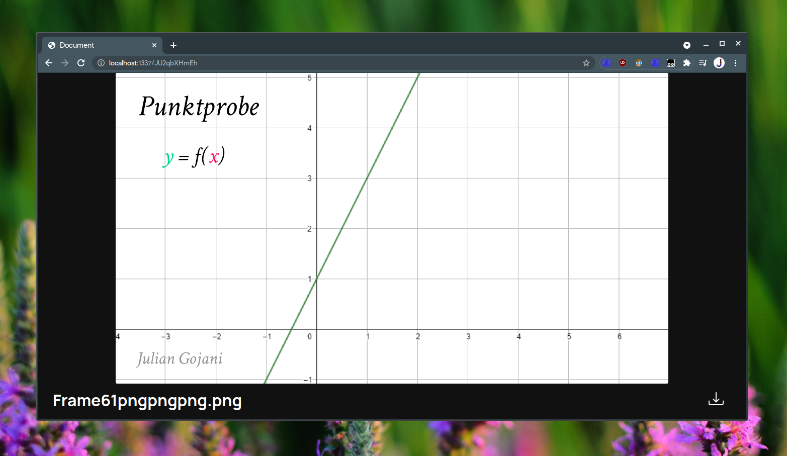
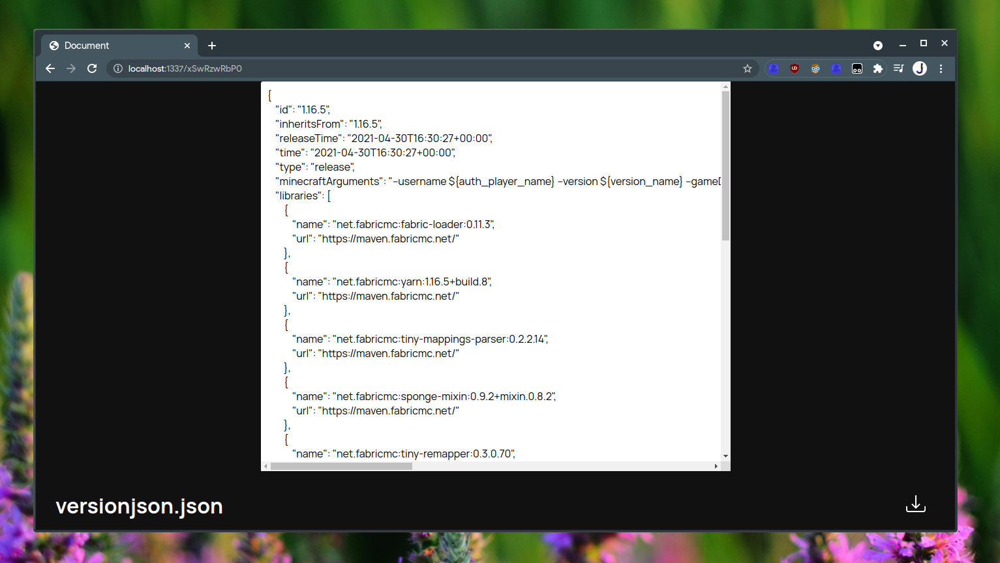

# UploadMe
## Upload via curl
```bash
curl -F f=@file.png mydomain.com
```

## Frontend
#### Home-Screen (You can disable it)

#### Image Preview

#### Text-File preview


## Installation
### Docker-Compose
```bash
docker-compose build
docker-compose up
```
